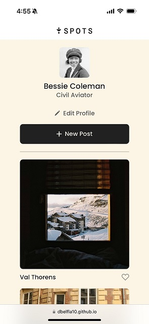

# Spots Project

## Description

Spots is an app where you can create a profile and upload images of places that you want to share.

## Tech Stack

- Semantic HTML5
- CSS
- Responsive Grid
- CSS Media Queries

## Features

Responside design was implemented for devices with screen width less than 627px.

## Deployment

This webpage is deployed to GitHub Pages

- https://dbelfla10.github.io/se_project_spots/

## Demo

Watch a video of this project on the link below

- [Spots project demo](https://drive.google.com/file/d/16R_p-ONE5S8FS_029fKHjpguf_lwOEzK/view?usp=sharing)
